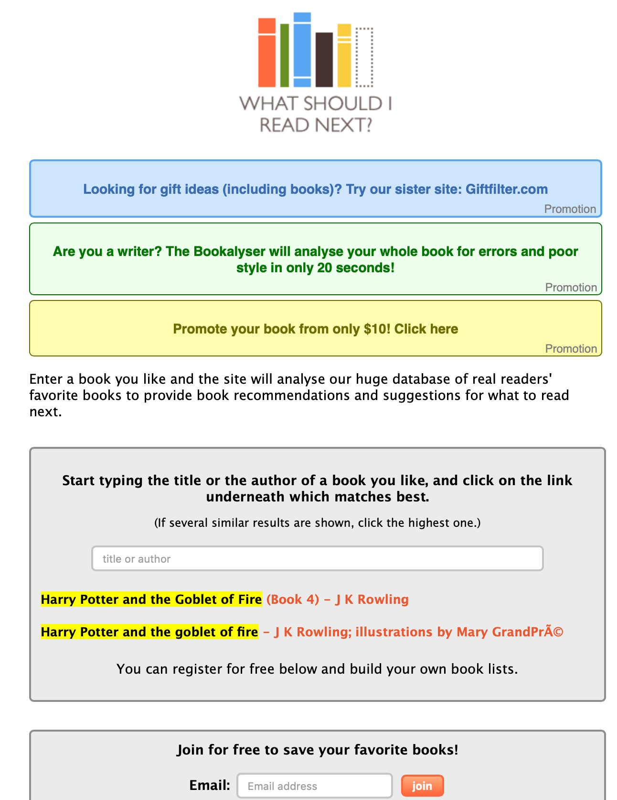
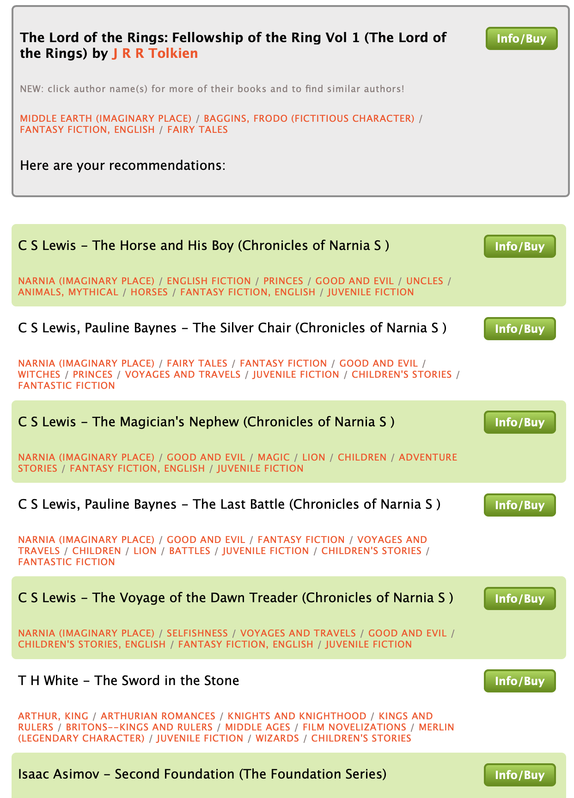
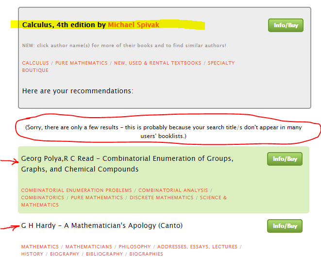

```{r setup, include=FALSE}
knitr::opts_chunk$set(echo = TRUE, warning = FALSE, message=FALSE)
```

# Overview

This assignment requires the analysis of a recommender system used by a public website.  We consider the algorithm and user interface of a lesser known website called [www.whatshouldireadnext.com]   This website allows the website visitor (i.e. the user) to obtain a list of recommended books to read next.

In this article, we illustrate how the site works, evaluate the scenario design and the recommendation algorithm used by the website based on available public information.   We conduct some ad hoc tests of the recommendations offered by the website and comment on their accuracy and relevance for the intended purpose.


## A Tour of the Site

The website is simple and single-purpose.   It does not sell products (specifically books).  The main page is shown below.



The website is astonishingly simple to use.   On the main page, there is a single form to allow the user to type either a title or author.   There is no password or registration process to use the site.

To illustrate the user interface and query results, I type in a well known classic "The Lord of the Rings: Fellowship of the Ring Vol 1 (The Lord of the Rings)" by J.R.R. Tolkien.  The set of results is displayed as follows:




Finally, if the user clickes on the green button entitled "Info/Buy" next to each book returned by the recommender algorithm, the user is directed to the book's page on Amazon.com.   The website acknowledges that it gets a commission for each book sold through the click-through of its link.

[https://www.amazon.com/s?k=The+Horse+and+His+Boy&rh=n%3A283155&tag=wsirn-20]

The website is recognized through the tag **wsirn-20** embedded in the URL of the green button.

Lastly, the website was founded in 2005 by a small number of individuals.  WSIRN describes itself as:

the brainchild of write/designer Andrew Chapman and marketing expert Paul Lenz at Thoughtplay Ltd.


# Scenario Design

We use the 3-question framework to analyze the user experience on the website.

## Who are the target users?

The key users are English speaker (or readers) with internet access from anywhere around the world.   We can speculate that their age range is young adult to senior citizen.  
The target users are likely to be bibliophiles.

Since they have internet access, many of them will be aware of reading, buying or reviewing books online.   In particular, this website will be one of many competing websites offering reading advice.

To be useful, 

For example, a reader querying Amazon.com for the same book will also get other book recommendations.

## What are their key goals?

The key goal of users appears to be identifying related books that could interest them.
If we look at the vital statistics page of the WSIRN site, the top choices for searches are popular books.   For example, the novel "The Hunger Games: Book 1" by Suzanne Collins was the second most popular book searched in month of March 2019 and the top book searched on April 9, 2019.

[https://www.whatshouldireadnext.com/stats.php]

We can assume that users are using well-known best sellers to provide an example of the type of book they want to read rather than giving a name of their most recently read book.

## How can you help them accomplish those goals?

To help users accomplish their goals, the website need understand why users want advice to read books and what kind of advice is sought.  If the reader provides a representative book that they like, the recommender system designers need to consider carefully what the user wants.  There are a few plausible scenarios to consider.  For each scenario, we can consider if the website is helping them.

 - A. Someone has a conscious reading program and wants to identify the next logical book in a series or theme.
 
 - B. Someone likes a particular book X and wants a menu of books liked by people who also like X.
 
 - C. Someone wants to be inspired by a serendipitous book drawn from those books similar to or on the same lists as X.
 
In each case, the algorithm should be adapted to learn more about the user's preferences besides the name of one book.
The only way to assess the ability of WSIRN algorithm to meet the other goals is to run test queries so there is limited public documentation about this website.

# The Recommendation Algorithm

The WSIRN website briefly describes the recommendation algorithm on their page:  [https://www.whatshouldireadnext.com/faq.php]  

>WSIRN produces recommendations based purely on collective taste: when books are entered into the same favorites list, they become associated with each other. The more often particular items >appear on different lists, the stronger that association becomes. Purely and simply, WSIRN represents mass opinion about books. For the technically minded, this is a collaborative filtering >system, using our own bespoke algorithm called 'Incidence Bias Weighting' and partly using association rules.
 
My interpretation is that the WSIRN algorithm is item-based collaborative filtering.  

## Test with Obscure Books

I test this theory by building a list of mathematics books which will be used by the recommender algorithm.
This list was uploaded into WSIRN under my user account.  

```{r}
library(tidyverse)
library(kableExtra)
library(knitr)

df = data.frame(  
  Author = c("G. H. Hardy", "Michael Spivak", "Georg Polya, R. C. Read"),
  Title = c("A Mathematician's Apology (Canto)", "Calculus, 4th edition", "Combinatorial Enumeration of Groups, Graphs, and Chemical Compounds") ,
  ISBN = c("0521095778", "0914098918", "0387964134")
  )

df %>% kable() %>% kable_styling(bootstrap_options = c("hover"))

```

Notice that this list contains old obscure mathematical texts.  A community of readers of mathematical texts would recognize them instantly.
Since these texts are now associated with each other, if another user queries for one of the 3 texts, there is a likelihood that they are find the other 2 texts.
However, there are two key observations:  

 - These books have no relationship to each other other than my familiarity with them.  They are a random assortment of books I know.
 
 - There is no logical reason another WSIRN user should read these books.
 
Now when I run the search under an anonymous user for Michael Spivak's Calculus, the algorithm returns all the books of my personal list.




## Test with BestSellers

If we go to the NYTimes Best Sellers lists, we can find the top 3 books on the combined Print & E-Book Non-Fiction list.  [https://www.nytimes.com/books/best-sellers/]

```{r}

df = data.frame(
  Rank = c( 1, 2, 3 ) ,
  Author = c("Michelle Obama", "Tara Westover", "Ben Shapiro") ,
  Title = c("Becoming", "Educated", "The Right Side of History") ,
  WeeksOnList = c( 20, 58, 2 )
)

df %>% kable() %>% kable_styling(bootstrap_options = c("hover"))
```

```{r out.width="30%"}
knitr::include_graphics(c("obama.jpg", "educated.jpg", "history.jpg"))
```

When we query for Michelle Obama's book "Becoming", WSIRN returns one book only:  **The Girl's Guide to Hunting and Fishing** by Melissa Bank.
The recommended book is based on the life of a teenage girl and does not appear to be consistent with someone reading Obama's autobiography.

When we query for Tara Westover's "Educated", WSIRN returns 50 results starting with **Angle of Repose** by Wallace Stegner and **Where the Crawdads Sing** by Delia Owens.
Westover's book is a fictionalized autobiography about her struggles to rise from an inpoverished, home-schooled Mormon upbringing in the Great Plains to become a Oxford PhD student and scholar.   Stegner's book won the 1972 Pulitzer Prize for Fiction.  It is a novel about a historian who recounts his frontier-era grandparents.   The relationship between the texts is their plot setting in the Great Plains of the United States and the endurance of hardship in a frontier environment.   By contrast, Owens' book is also on the NYTimes Best Sellers list.  It describes the life of a young girl living in the swamps of North Carolina.  Their biggest common feature is being on the same best sellers list.

Lastly, Ben Shapiro's book returns no results from WSIRN.  Apparently, it is not popular enough to be included on anyone's list.

# Interpretation

We are now able to evaluate the effectiveness of the recommender system with some concrete evidence.
While, we can expect it to lack recommendation for obscure math texts, we did not expect the poor performance on 2 of the 3 NYTimes Bestsellers.   Moreover, for rare or obscure books, the recommendations are unstable strongly influenced by even 1 person's list.  I demonstrated the ability to produce ALL the recommendations from WSIRN by simply uploading one list of math texts.   Therefore  I believe WSIRN fails to meet the goals A and B above.   Someone with a systematic reading program on a subject would be misled by the recommendation.  For example, if I want to read about the philosophy of mathematics, I don't want to learn about counting molecules in organic chemistry.  Likewise, if I enjoy reading about Michelle Obama's lifestory, WSIRN fails to find results of like-minded readers.  It fails on goal B.   On goal C, providing serendipitous inspiration, the system could be useful.  The recommendations associated with Tara Westover's book were valid.   

The evidence clearly suggests that WSIRN has an incomplete list of book lists.  My recommendation is that WSIRN create lists based on proximity by topic  (A content-based approach) and blend it with the collaborative filtering.  Their data source of ISBN seems reasonable.  All the top 3 bestsellers are recognized by ISBN but not listed by any readers.   By including content-based recommendations, empty or small results are avoided.

Overall, I believe the website was imperfect and impractical to use.   However, the simplicity of its recommendation system allows interesting and precise tests with sharp results.  A similar analysis on a more mature recommender system (like Amazon.com ) would be more ambiguous.


